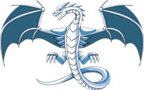

# Hi there 👋

## About me

- I am an Automotive Software Development Engineer in China 🇨🇳.
- I use C++ and Python as my major development languages.
- I am interested in run-time/compile-time, compiler and language tooling related development.

### Translated Books

- [《C++23高级编程 (第6版)》](https://item.jd.com/10168368653888.html)

- [《C++ 20模板元编程》](https://item.jd.com/15103016.html)

- [《C++ Core Guidelines解析》](https://item.jd.com/14078078.html)

- [《C++ Templates (第2版·中文版)》](https://item.jd.com/14310382.html)

- [《C++20高级编程(第5版)》](https://item.jd.com/13706858.html)

- [《现代C++白皮书》](https://github.com/Cpp-Club/Cxx_HOPL4_zh)

## My Technical Stack

   
